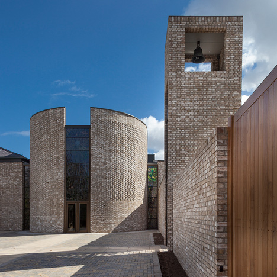
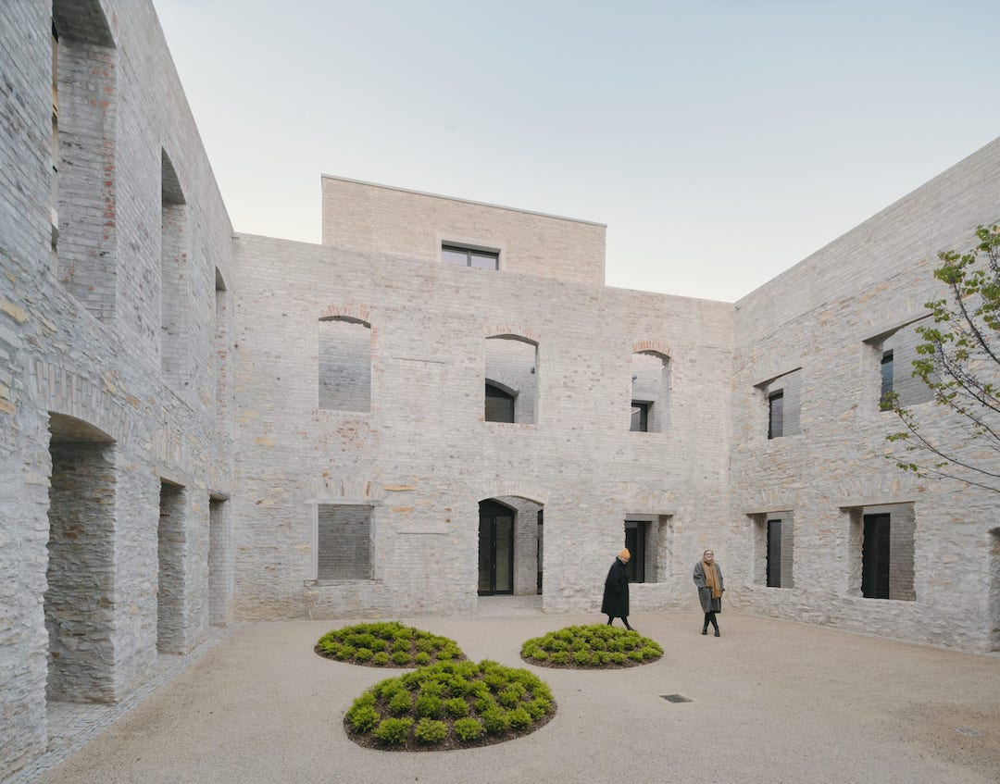
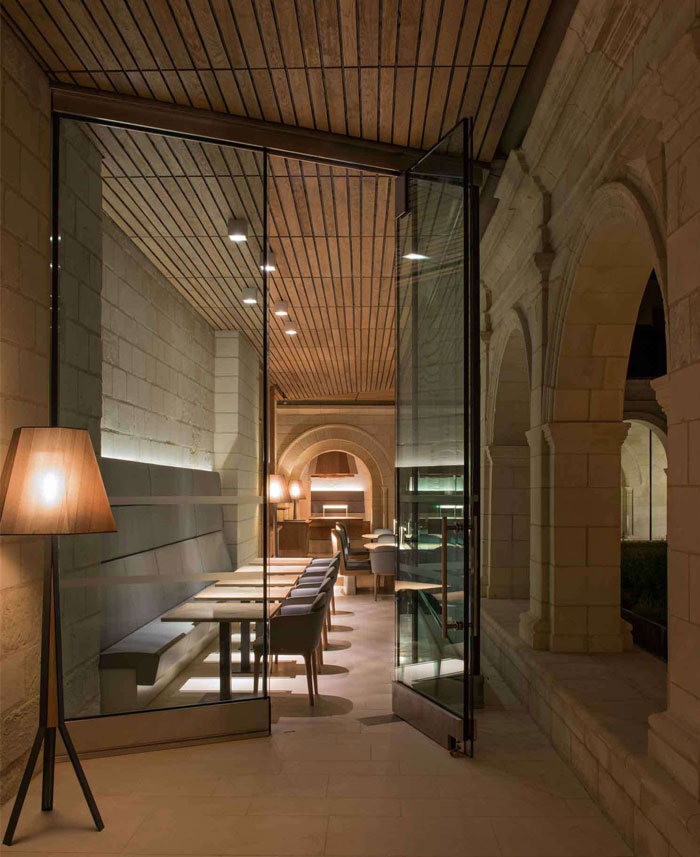

# The Order of the Third Light

The [Order of the Third Light](https://1618033989.com) is a new religion that seeks to make sacred that which is truly sacred.

A religion based on reason, math, knoweldge, and cooperation -- a religion
for the next 2,000 years.

  - [Founding timeline](#founding-timeline)
  - [Testament of Light](#testament-of-light)
  - [Order Governance](#order-governance)
  - [The First Athenaeum](#the-first-athenaeum)

## Founding timeline

**1618033989**
- The Order of the Third Light begins.
- Work commences on the Testament of Light, the Order Governance, and the First Athenaeum.

**1618033989-1642191806**
- Twenty three more join Apostle Kappa as the Apostles of the Third Light.
- The First Version of the Testament is committed.
- The First Version of the Governance is committed.
- The First Athenaeum is planned.

**1642191806**
- The First Plenary of the Apostles. The Apostles assemble to plan the future of the Order, and commit the signing ceremony of the First Version of the Governance.

**1642191806-1681279975**
- The Second Version of the Testament is committed.
- The Second Version of the Governance is committed.
- Work begins on the First Athenaeum.

**1681279975**
- The Second Plenary of the Apostles. The Apostles assemble to plan the future of the Order, and commit the signing ceremony of the Second Version of the Governance.

**1783614130**
- The Third Plenary of the Apostles.

## Testament of Light

The Testament of Light is the sacred text of the Order. The
[First Version](https://github.com/orderoflight/testament)
is being written now. Any one can contribute to it's message.

## Order Governance

Governance of the Order occurs on crypto-economic systems; to start,
the Ethereum blockchain. See [Order Governance](https://github.com/orderoflight/governance) for more details.

## The First Athenaeum

The First Athenaeum will be the Order's first sacred place of Light and Love -- a monastery and library, a temple to the divine forces.

